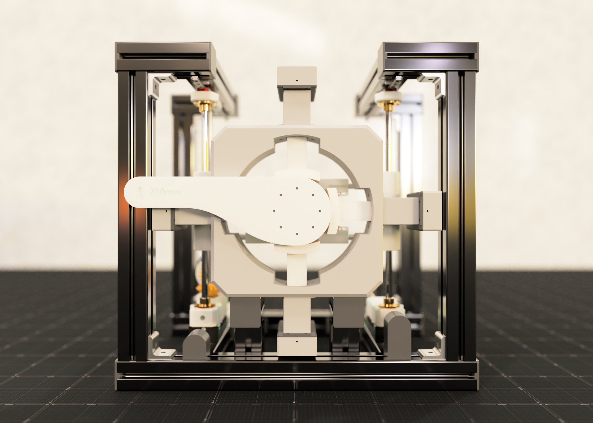

<h1 align="center">Getriebe Prüfstand</h1>

Prüfstand zur Leistungserfassung zylindrischer Getriebe

## Hintergrund

Die Leistungsprüfung von Getrieben bedarf oftmals speziellen Vorrichtungen. Diesen Aufwand gilt es durch einen Prüfstand, welcher eine Vielzahl von Getrieben prüfen kann, zu minimieren.

## Features

Die aktuelle Version des Prüfstandes erlaubt die Einspannung von zylindrischen Getrieben mit einem Durchmesser von 15 bis 30 Zentimetern. Getriebe "schweben" im Zentrum des Prüfstandes und können semi-automatisch eingespannt werden.

Optimiert wurde für Getriebe mit Antrieb vom Gehäusetyp _Nema_. Falls der Schwerpunkt antriebsbedingt tief in Richtung des Prüfstandsinneren liegt, werden die Körper zustätzlich von Querstreben unterstützt. Hierfür wird jedoch eine passende Unterplatte benötigt (im Modell für _Nema 17_).

## Umsetzung

### Getriebe-Greifer

Die Getriebe Greifer sind vier konzentrisch angeordnete, elektrisch angetriebene Linearaktoren, welche zur Einspannung des Getriebes dienen. Abstrahiert ist ihr funktionales Ende Teilstrecke eines Kreises mit einem Durchmesser gleich dem der Frontplatte. So entsteht im eingefahrenen Zustand ein schlüssiger Kreis mit dem Hauptteil.

Den Antrieb eines Linearaktors übernimmt in diesem Design ein kleiner Schrittmotor. Kabelkanäle wurden zur Installationsfreundlichkeit im Hauptteil eingeplant.

### Schwebende Befestigung

Durch Querstreben im hinteren Teil des Prüfstandes können Getriebe mit beliebig großen Antrieben getestet werden. Sie sind in ihrer Bewegung auf eine Achse durch Linearschienen limitiert. Eine Gewindespindel kann per Kurbel rotiert werden, welche die vertikale Position der Streben bestimmt.

### Kraftmessung

Die Kraftmessung erfolgt mit einer Wägezelle am Ende des Endeffektors. Im Design ist der Endeffektor mit 200 Millimeter Länge modelliert. Die Wägezelle soll an der Extrusion angebracht werden.

## Hürden

### Antriebsunabhängige Befestigung

Mit seteigender Größe verschiebt sich auch der Massenschwerpunkt tiefer in den Prüfstand. Das entstehende Moment an den Getriebe-Greifern gilt es zu reduzieren. Somit wurden Querstreben eingeführt, welche die Last des Antriebes auf sich nehmen sollen. Die Querstreben selbst sind im Design an vertikalen Stangen vom gleichen Typ durch Flanschkupplungen befestigt. Natürlich bedarf es nur die untere Strebe zur Entlastung des Systems, jedoch kann eine zusätzliche Strebe zur Steifigkeit beitragen. Diese wurde mittels Scherenhub-Mechanismus an die untere gekoppelt.
Die eigentliche Last wird letztendlich einseitig durch eine Gewindespindel abgetragen.

Es empfiehlt sich außerdem einen für den Antrieb maßgeschneiderten Sockel auf den Querstreben anzubringen. Der Scherenhub-Mechanismus kann somit horizontale Translation reduzieren und die Steifigkeit erhöhen.

## Weiterführendes

Den ganzen Artikel über das Projekt steht auf meiner <a href="https://philipsi.de">Portfolio Website</a> zur Verfügung. In diesem finden Sie auch Hardware Liste & Co. Weitere Renderings finden Sie im Unterverzeichnis `3D_models/renderings`.

Es sei wichtig anzumerken, dass dieses Projekt (noch) nicht in Wirklichkeit umgesetzt wurde. Daher sind Berücksichtigungen für die Installation vermutlich nicht vollständig abgedeckt.
